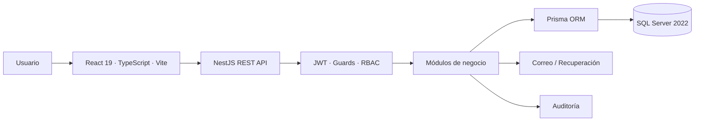

<p align="center">
  
</p>

<p align="center">
   
</p>

<p align="center">
  
  
</p>

<p align="center">
  <strong>CRM, proyectos, cotizaciones y gestión empresarial en una plataforma web multiempresa.</strong>
</p>

<p align="center">
  React · NestJS · Prisma · SQL Server · Docker · GitHub Actions
</p>

## 📘 Descripción

**AdminGest** es una plataforma web multiempresa orientada a la gestión comercial, administrativa y de proyectos. Centraliza prospectos, clientes, oportunidades, actividades, cotizaciones, reportes, usuarios, roles y proyectos en una sola solución moderna.

El proyecto reconstruye de forma independiente el trabajo final académico **GestorAdministrativo**, desarrollado para la asignatura **Administración de Proyectos de Software (SOF-013)** del Instituto Tecnológico de Las Américas (ITLA), período **2018-C3**.

## ✨ Funcionalidades principales

- CRM multiempresa con prospectos, clientes, oportunidades, actividades y pipeline comercial.
- Cotizaciones profesionales con descuentos, ITBIS, QR y verificación pública.
- Proyectos, tareas, cronograma, importación/exportación CSV y compatibilidad con Microsoft Project.
- Dashboard ejecutivo, reportes, exportaciones y diseño responsive.
- Gestión de usuarios, roles y permisos con RBAC.
- Perfil, recuperación y cambio seguro de contraseña.
- Validación dominicana de cédula y RNC.
- Accesibilidad alineada con NORTIC B2:2017 y WCAG 2.0 nivel AA.

## 🛡️ Seguridad

AdminGest incorpora autenticación JWT, contraseñas con bcrypt, autorización basada en roles, aislamiento multiempresa, recuperación de contraseña con tokens de un solo uso, rate limiting, Helmet, CORS configurable, validación estricta de DTO, auditoría de operaciones sensibles y gestión de secretos mediante variables de entorno.

La API es la fuente de verdad de autorización. Aunque la interfaz oculte una acción, el backend vuelve a validar el rol, recurso y tipo de operación antes de procesarla.

Consulta [SECURITY.md](SECURITY.md) y la [matriz RBAC](docs/security/rbac-matrix.md) para la documentación completa.

## 🧰 Stack tecnológico

### ⚛️ Frontend

<p>
  
</p>

- React 19
- TypeScript
- Vite
- React Router
- TanStack Query
- Vitest
- Testing Library

### ⚙️ Backend

<p>
  
</p>

- Node.js
- NestJS 11
- Passport
- JWT
- Swagger/OpenAPI
- Jest

### 🗄️ Base de datos y persistencia

<p>
  
  
</p>

- Microsoft SQL Server 2022
- Prisma ORM 6
- Migraciones versionadas
- Modelo relacional multiempresa

### 🧪 Calidad, automatización e infraestructura

<p>
  
</p>

<p>
  
  
  
  
</p>

- npm workspaces
- ESLint
- Prettier
- Jest
- Vitest
- GitHub Actions
- Docker Compose

## 🏗️ Arquitectura



Consulta [docs/ARCHITECTURE.md](docs/ARCHITECTURE.md) para la documentación arquitectónica completa.

## 📋 Requisitos

- Git
- Node.js 22 o superior
- npm compatible con el `package-lock.json`
- SQL Server Express 2022 recomendado para desarrollo local
- Docker Desktop opcional

## 🚀 Instalación local

```bash
git clone https://github.com/Jairo0811/AdminGest.git
cd AdminGest
npm ci
```

Prepara los archivos de entorno, configura SQL Server y ejecuta:

```bash
npm run db:generate
npm run db:migrate
npm run db:seed
npm run dev
```

### 📱 Acceso desde un móvil en la red local

En desarrollo, el frontend Vite escucha en `0.0.0.0:5173` y reenvía las peticiones `/api` al backend NestJS local. Esto evita configurar la IP de la API en el teléfono.

Con la PC y el móvil conectados a la misma red:

1. Ejecuta `npm run dev`.
2. Obtén la IPv4 de la PC con `ipconfig`.
3. Abre desde el navegador del móvil:

```text
http://<IP-DE-LA-PC>:5173
```

Ejemplo:

```text
http://192.168.1.50:5173
```

El backend continúa disponible localmente en el puerto `3000`. Si Windows solicita permiso de firewall para Node.js, permite únicamente redes privadas.

## 🔑 Credenciales de demostración

| Campo | Valor |
|---|---|
| **Correo** | `admin@admingest.com.do` |
| **Contraseña** | `AG2026AdminGest!` |

> Estas credenciales son para desarrollo y demostración. Deben cambiarse antes de publicar la aplicación.

## ✅ Validación técnica

```bash
npm run db:generate
npm run db:validate
npm run lint
npm run test
npm run build
```

GitHub Actions valida automáticamente Prisma, migraciones, lint, pruebas de API y web, autorización por roles, builds y auditoría de dependencias.

## 📚 Documentación

- [Arquitectura](docs/ARCHITECTURE.md)
- [Accesibilidad](docs/ACCESSIBILITY.md)
- [Matriz RBAC](docs/security/rbac-matrix.md)
- [Despliegue](docs/DEPLOYMENT.md)
- [Recuperación de contraseña](docs/PASSWORD_RESET.md)
- [Política de seguridad](SECURITY.md)
- [Componentes de terceros](THIRD_PARTY_NOTICES.md)
- [Historial de cambios](CHANGELOG.md)

## 👥 Equipo Académico Original

| 👤 Integrante | 🆔 Matrícula |
|---|---|
| 👨🏻‍💻 Francis Jairo Matías Rosario | 2015-2984 |
| 👨🏻‍💻 Isaías Pérez Moya | 2016-3595 |
| 👨🏻‍💻 Enmanuel Avilez Valoy | 2016-3789 |
| 👩🏻‍💻 Diana Caroline Mejía Encarnación | 2016-3796 |
| 👨🏻‍💻 Andrés Eudoro Pujols | 2016-3917 |
| 👨🏻‍💻 Alexander Dionicio Mercedes | 2016-3962 |
| 👨🏻‍💻 Raymundo Eduardo Peña Sánchez | 2016-4276 |

## 🎓 Información Académica

| Información | Detalle |
|---|---|
| 📖 Asignatura | Administración de Proyectos de Software (SOF-013) |
| 👨‍🏫 Profesor | Juan Martínez López |
| 🏫 Institución | Instituto Tecnológico de Las Américas (ITLA) |
| 📅 Período académico | 2018-C3 |
| 📁 Tipo de entrega | Proyecto Final |

## 🔄 Continuidad académica

AdminGest forma parte de **dos líneas académicas verificables** dentro de la trayectoria del ITLA. Una corresponde a continuidad docente y la otra a una compañera recurrente. Se documentan de forma separada porque representan relaciones diferentes.

### 👨‍🏫 Continuidad por profesor

El profesor **Juan Martínez López** aparece en dos proyectos académicos de la colección:

| Orden | Proyecto académico original | Evolución actual | Asignatura | Período |
|---:|---|---|---|---|
| 1 | RadioEmisora | [**RadioEmisora RD**](https://github.com/Jairo0811/RadioEmisora) | Diseño Centrado en el Usuario (SOF-010) | 2018-C1 |
| 2 | GestorAdministrativo | **AdminGest** | Administración de Proyectos de Software (SOF-013) | 2018-C3 |

La primera etapa estuvo enfocada en interacción, usabilidad y experiencia de usuario; la segunda amplió la formación hacia planificación, organización y gestión integral de proyectos de software.

### 👥 Continuidad por estudiante

**Diana Caroline Mejía Encarnación (2016-3796)** coincidió con Francis Jairo Matías Rosario en dos proyectos académicos consecutivos durante 2018:

| Orden | Código | Asignatura | Proyecto actual | Período | Compañera recurrente |
|---:|---|---|---|---|---|
| 1  | Programación 3 (SOF-005) | [**GamePoint POS**](https://github.com/Jairo0811/GamePointPOS) | 2018-C2 |
| 2  | Administración de Proyectos de Software (SOF-013) | **AdminGest** | 2018-C3 |

La recurrencia queda respaldada por el mismo **nombre completo y matrícula** en los equipos académicos originales de ambos repositorios.

Vistas en conjunto, estas relaciones permiten observar una trayectoria que combina **experiencia de usuario**, **programación aplicada** y **gestión de proyectos de software**, sin presentar los sistemas como dependencias técnicas ni como secuelas funcionales.

## 📄 Licencia

Este proyecto se distribuye bajo la licencia incluida en el repositorio.
