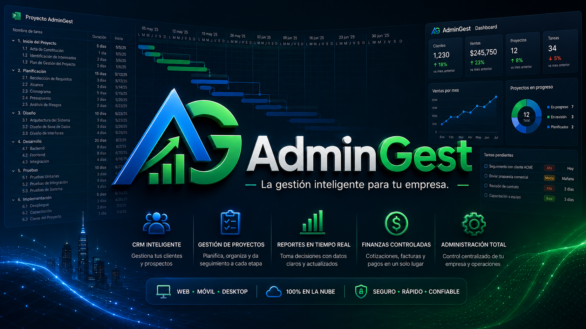

<p align="center">
  
</p>

<p align="center">
   
</p>

<p align="center">

  
  
</p>

<p align="center">
  <strong>CRM, proyectos, cotizaciones y gestión empresarial en una plataforma web multiempresa.</strong>
</p>

<p align="center">
  React · NestJS · Prisma · SQL Server · Docker · GitHub Actions
</p>

## 📘 Descripción

**AdminGest** es una plataforma web multiempresa orientada a la gestión comercial, administrativa y de proyectos. Centraliza prospectos, clientes, oportunidades, actividades, cotizaciones, reportes, usuarios, roles y proyectos en una sola solución moderna.

El proyecto reconstruye de forma independiente el trabajo final académico **GestorAdministrativo**, desarrollado para la asignatura **Administración de Proyectos de Software (SOF-013)** del Instituto Tecnológico de Las Américas (ITLA), período **2018-C3**.

## ✨ Funcionalidades principales

### 🤝 CRM y operación comercial

- Registro de empresa e inicio de sesión con JWT.
- Aislamiento de datos por empresa.
- Gestión de prospectos con origen, prioridad, responsable y ciclo de conversión.
- Gestión de clientes y contactos.
- Pipeline comercial configurable.
- Oportunidades con valor estimado, probabilidad y fecha esperada de cierre.
- Vista Kanban de oportunidades.
- Actividades comerciales: llamadas, correos, reuniones, visitas, tareas y seguimientos.
- Calendario comercial.
- Catálogo de productos y servicios.

### 🧾 Cotizaciones profesionales

- Creación de cotizaciones con uno o varios conceptos.
- Descuento configurable.
- ITBIS fijo del 18 %.
- Cálculo automático de subtotal, descuento, base imponible, impuesto y total.
- Documento imprimible con branding corporativo.
- Guardado como PDF desde el navegador.
- Código QR de autenticidad dentro del documento.
- Logo oficial de AdminGest incrustado dentro del QR.
- Código público UUID único y no predecible por cotización.
- Página pública de verificación sin necesidad de iniciar sesión.
- Validación de estado, empresa emisora, cliente, fechas e importes.
- URL pública configurable mediante `VITE_PUBLIC_APP_URL`.

### 📊 Proyectos y productividad

- Proyectos asociados a clientes y oportunidades.
- Presupuesto, fechas, estado y progreso.
- Gestión de tareas y responsables.
- Jerarquía de tareas.
- Cronograma visual.
- Impresión de cronograma tipo Gantt.
- Importación y exportación CSV compatible con Microsoft Project.

### 🖥️ Administración y experiencia de usuario

- Dashboard ejecutivo con KPIs, tendencias, gráficos y embudo comercial.
- Reportes ejecutivos.
- Exportación de listados a Excel.
- Impresión y exportación PDF desde el navegador.
- Navegación avanzada con breadcrumbs.
- Buscador y notificaciones.
- Tema claro y oscuro.
- Sidebar colapsable.
- Diseño responsive.
- Configuración de empresa.
- Validación dominicana de cédula y RNC.

### 👤 Usuarios, roles y perfil

- Gestión de usuarios por empresa.
- Roles disponibles: `SUPER_ADMIN`, `ADMIN`, `SALES_MANAGER`, `SALES_REP`, `PROJECT_MANAGER` y `VIEWER`.
- Activación y desactivación de cuentas.
- Prevención de auto-desactivación.
- Perfil personal.
- Cambio de contraseña verificando la contraseña actual.
- Restablecimiento administrativo de contraseña.
- Recuperación de contraseña mediante enlace temporal.
- Cierre automático de sesión al expirar el JWT.

## 🛡️ Seguridad

AdminGest incorpora autenticación JWT, contraseñas con bcrypt, autorización basada en roles, aislamiento multiempresa, recuperación de contraseña con tokens de un solo uso, rate limiting, Helmet, CORS configurable, validación estricta de DTO, auditoría de operaciones sensibles y gestión de secretos mediante variables de entorno.

Consulta [SECURITY.md](SECURITY.md) para la política completa.

## 🇩🇴 Validación dominicana

AdminGest valida cédula dominicana y RNC en frontend y backend, aplica formato automático y almacena los valores normalizados sin guiones.

La implementación de cédula fue adaptada con atribución al proyecto público de OGTIC **Cuenta Única Registry**. Consulta [THIRD_PARTY_NOTICES.md](THIRD_PARTY_NOTICES.md).

## 🧰 Stack tecnológico

### ⚛️ Frontend

<p>
  
</p>

- React 19
- TypeScript
- Vite
- React Router
- TanStack Query
- Lucide React
- QRCode
- Vitest
- Testing Library

### ⚙️ Backend

<p>
  
</p>

- Node.js
- NestJS 11
- Passport
- JWT
- Swagger/OpenAPI
- `class-validator`
- bcrypt
- Jest

### 🗄️ Base de datos y persistencia

<p>
  
  
</p>

- Microsoft SQL Server 2022
- Prisma ORM 6
- Migraciones versionadas
- Modelo relacional multiempresa

### 🧪 Calidad e infraestructura

<p>
  
</p>

- npm workspaces
- ESLint
- Prettier
- Jest
- Vitest
- GitHub Actions
- Docker Compose

## 🏗️ Arquitectura

```text
React + TypeScript
        │
        │ REST + JWT
        ▼
NestJS modular
        │
        ├── Autenticación y autorización
        ├── CRM y operación comercial
        ├── Cotizaciones y verificación pública
        ├── Proyectos y tareas
        ├── Usuarios y perfil
        ├── Auditoría
        └── Servicios multiempresa
        ▼
Prisma ORM
        │
        ├── SQL Server Express 2022
        └── SQL Server en Docker Compose
```

La solución utiliza un monorepo con npm workspaces:

```text
AdminGest/
├── apps/
│   ├── api/
│   │   ├── prisma/
│   │   └── src/
│   └── web/
│       └── src/
├── docs/
├── .github/workflows/
├── docker-compose.yml
├── package.json
└── package-lock.json
```

Consulta [docs/ARCHITECTURE.md](docs/ARCHITECTURE.md) para las decisiones de arquitectura y separación de responsabilidades.

## 📋 Requisitos

- Git
- Node.js 22 o superior
- npm compatible con el `package-lock.json`
- SQL Server Express 2022 recomendado para desarrollo local
- Docker Desktop opcional para entornos reproducibles

## 🚀 Instalación local

### 1. Clonar el repositorio

```bash
git clone https://github.com/Jairo0811/AdminGest.git
cd AdminGest
```

### 2. Instalar dependencias

```bash
npm ci
```

### 3. Crear archivos de entorno

Windows PowerShell:

```powershell
Copy-Item .env.example .env
Copy-Item apps/api/.env.example apps/api/.env
Copy-Item apps/web/.env.example apps/web/.env
```

Linux y macOS:

```bash
cp .env.example .env
cp apps/api/.env.example apps/api/.env
cp apps/web/.env.example apps/web/.env
```

### 4. Crear la base de datos

```sql
CREATE DATABASE AdminGestDb;
GO
```

### 5. Configurar la API

```env
NODE_ENV=development
PORT=3000
DATABASE_URL="sqlserver://127.0.0.1:1433;database=AdminGestDb;integratedSecurity=true;trustServerCertificate=true"
CORS_ORIGIN=http://localhost:5173
JWT_SECRET=UNA_CLAVE_ALEATORIA_DE_AL_MENOS_32_CARACTERES
JWT_EXPIRES_IN=8h
SWAGGER_ENABLED=true
SEED_ADMIN_PASSWORD=AG2026AdminGest!
PASSWORD_RESET_URL=http://localhost:5173/reset-password
RESEND_API_KEY=
MAIL_FROM=AdminGest <no-reply@tu-dominio.com>
```

### 6. Configurar el frontend

```env
VITE_API_URL=http://localhost:3000/api
VITE_PUBLIC_APP_URL=http://localhost:5173
```

### 7. Preparar Prisma y la base de datos

```bash
npm run db:generate
npm run db:migrate
npm run db:seed
```

## 🔑 Credenciales de demostración

Después de ejecutar el seed, puedes iniciar sesión con:

| Campo | Valor |
|---|---|
| **Correo** | `admin@admingest.com.do` |
| **Contraseña** | `AG2026AdminGest!` |

> La contraseña se obtiene de `SEED_ADMIN_PASSWORD`. Si modificas esa variable antes de ejecutar el seed, la contraseña del administrador se actualizará con el nuevo valor.

### 8. Iniciar el proyecto

```bash
npm run dev
```

Servicios locales:

| Servicio | URL |
|---|---|
| Aplicación web | http://localhost:5173 |
| API | http://localhost:3000/api |
| Swagger | http://localhost:3000/docs |
| Health check | http://localhost:3000/api/health |
| Verificación pública | http://localhost:5173/verify/quote/{publicCode} |

## 🐳 Docker Compose

```bash
docker compose up -d
docker compose ps
```

Configura `apps/api/.env` para conectarte al SQL Server del contenedor y luego ejecuta:

```bash
npm run db:generate
npm run db:migrate
npm run db:seed
npm run dev
```

Para detener el entorno:

```bash
docker compose down
```

## ✅ Validación técnica

```bash
npm run db:generate
npm run db:validate
npm run lint
npm run test
npm run build
```

Resultados validados:

- API: 6 suites y 17 pruebas aprobadas.
- Web: 5 archivos y 12 pruebas aprobadas.
- Total: 29 pruebas aprobadas.
- Migraciones SQL Server aplicadas correctamente.
- Lint limpio.
- Build de NestJS y Vite exitoso.

## 📚 Documentación

- [Arquitectura](docs/ARCHITECTURE.md)
- [Despliegue](docs/DEPLOYMENT.md)
- [Recuperación de contraseña](docs/PASSWORD_RESET.md)
- [Política de seguridad](SECURITY.md)
- [Componentes de terceros](THIRD_PARTY_NOTICES.md)
- [Historial de cambios](CHANGELOG.md)

## 👥 Equipo académico original

| 👤 Integrante | 🆔 Matrícula |
|---|---|
| Francis Jairo Matías Rosario | 2015-2984 |
| Isaías Pérez Moya | 2016-3595 |
| Enmanuel Avilez Valoy | 2016-3789 |
| Diana Caroline Mejía Encarnación | 2016-3796 |
| Andrés Eudoro Pujols | 2016-3917 |
| Alexander Dionicio Mercedes | 2016-3962 |
| Raymundo Eduardo Peña Sánchez | 2016-4276 |

## 🎓 Información académica

| Información | Detalle |
|---|---|
| Asignatura | Administración de Proyectos de Software (SOF-013) |
| Institución | Instituto Tecnológico de Las Américas (ITLA) |
| Período académico | 2018-C3 |
| Tipo de entrega | Proyecto final |

## 📄 Licencia

Este proyecto se distribuye bajo los términos definidos en [LICENSE](LICENSE).
