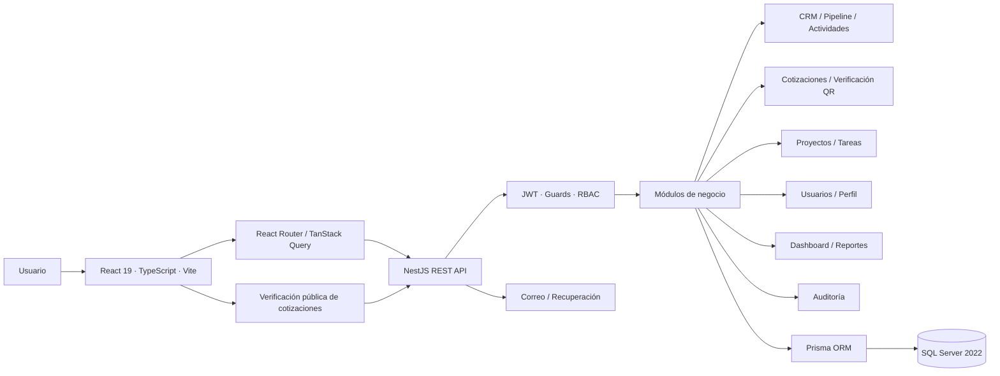
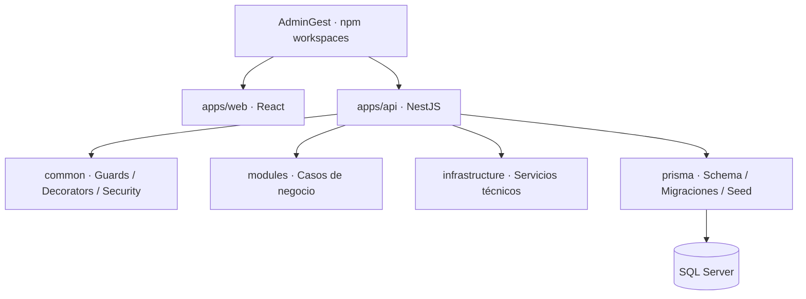
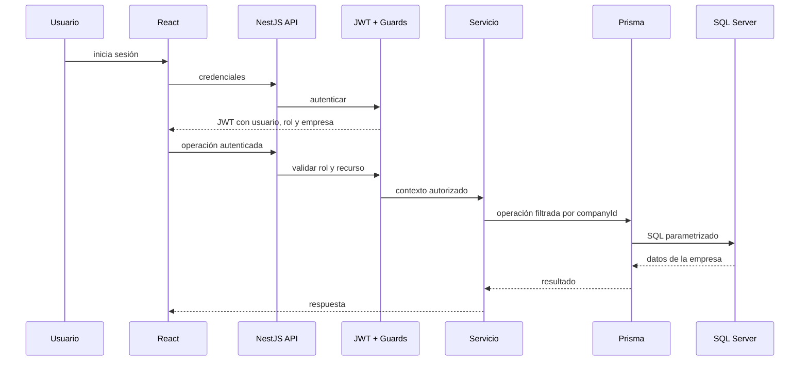

# Arquitectura de AdminGest

AdminGest utiliza un **monorepositorio con npm workspaces** y una arquitectura web modular con separación estricta entre experiencia de usuario, API, reglas de negocio y persistencia. El backend es la fuente de verdad para autenticación, autorización y aislamiento multiempresa.

## Vista general



La UI nunca sustituye la autorización del servidor. Aunque React oculte una acción, NestJS vuelve a validar el rol, la empresa y el recurso antes de ejecutar la operación.

## Decisiones principales

1. **React + TypeScript** para una interfaz modular, accesible y tipada.
2. **NestJS** para organizar la API por módulos, controladores, servicios y dependencias.
3. **Microsoft SQL Server 2022** como fuente transaccional principal.
4. **Prisma ORM** para el modelo relacional, migraciones y acceso tipado a datos.
5. **JWT** para autenticación y contexto de autorización.
6. Toda consulta empresarial se filtra por `companyId`, obtenido del contexto autenticado.
7. Las operaciones sensibles generan entradas de auditoría.
8. Los servicios externos permanecen detrás de contratos de infraestructura.

## Monorepo



### Responsabilidades

- `apps/web`: experiencia de usuario, rutas, formularios, consultas, navegación y estado de sesión.
- `apps/api/src/common`: seguridad, decoradores, guardas y contratos compartidos.
- `apps/api/src/modules`: módulos verticales del negocio.
- `apps/api/src/infrastructure`: adaptadores técnicos y acceso a servicios externos.
- `apps/api/prisma`: esquema, migraciones y datos iniciales.

## Módulos

- Autenticación y usuarios.
- Empresas y configuración.
- CRM: prospectos, clientes y contactos.
- Pipeline y oportunidades.
- Actividades y calendario.
- Catálogo y cotizaciones.
- Verificación pública mediante QR y UUID.
- Proyectos y tareas.
- Dashboard y reportes.
- Auditoría.

## Seguridad multiempresa



El cliente no envía un `companyId` confiable. Tras iniciar sesión, la API firma un JWT con el usuario, rol y empresa. Los servicios obtienen la empresa desde ese contexto y aplican el filtro en cada lectura o escritura.

## Flujo de una operación

```text
React → Controller NestJS → Guard/RBAC → Service → Prisma → SQL Server
```

Las respuestas regresan por el mismo límite HTTP. Esto mantiene el frontend desacoplado de Prisma y de la estructura interna de la base de datos.

## Criterio de evolución

AdminGest debe continuar como **monolito modular** mientras sus módulos compartan el mismo ciclo transaccional y de despliegue. Separar servicios independientes solo tendría sentido si aparecen necesidades reales de escalabilidad, propiedad de equipos o despliegue autónomo.
